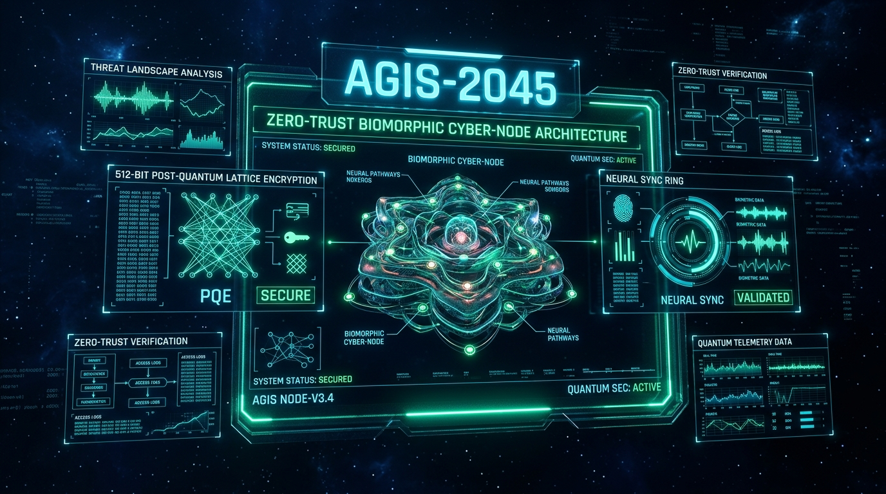

# AGIS 2045: Quantum Glass Zero-Trust Cyber-Node



> **Zero-Trust Biomorphic Cyber-Node Architecture** featuring volumetric quantum glass interfaces, neural intent routing, 512-bit post-quantum enclave cryptography, multi-stage shield defense, and differential-privacy telemetry sanitization.

---

## 🌟 Key Architecture Layers

### 1. Quantum Glass Visual System
- **Volumetric Translucent Surfaces**: 3D spatial depth modes (2D Flat, 2.5D Volumetric, 3D Quantum) rendered with dynamic alpha gradients and luminescent rim highlights.
- **Photonic Signal Palette**:
  - 🟢 **Operational Emerald** (`#10B981`): Nominal telemetry & verified operations.
  - 🔵 **Photonic Cyan** (`#00F5FF`): Active neural connectivity & quantum coherence.
  - 🔴 **Containment Crimson** (`#FF2A55`): Real-time threat isolation & containment gates.
  - 🟣 **Quantum Violet** (`#A855F7`): Enclave sealing & lattice encryption keys.
  - 🟡 **Solar Amber** (`#FFB703`): Dynamic policy re-evaluation warnings.
- **Immersive UI Canvas**: Deep space cobalt backdrop (`#050B18`) designed for high-contrast cyber telemetry.

---

### 2. Neural Intent Routing & Biometrics
- **Electro-Neural Waveforms**: Real-time sinusoidal and pulse-width neural telemetry monitors with dynamic galvanic response indicators.
- **Multi-Agent Active Threads**: Real-time task allocation with execution confidence meters, permission bounding, and intent classification.
- **Explicit Neural Confirmation Gate**: Hardened verification mechanism blocking cross-domain state escalations without direct operator confirmation.

---

### 3. Hardened Architecture Matrix (2024 Base vs. 2045 Quantum Core)
- Comprehensive side-by-side evolution matrix across all 7 operational layers:
  1. **UI Substrate**: Flat 2D Views $\to$ Volumetric Quantum Glass with spatial depth.
  2. **Biometrics & Authentication**: Static Biometrics $\to$ Continuous Biomorphic Neural Sync.
  3. **Intent & Autonomy Routing**: Unverified Tool Calls $\to$ Neural Intent Gate & Sub-Agent Sandboxing.
  4. **Threat Defense**: Perimeter Firewalls $\to$ 5-Stage Zero-Trust Dynamic Shield Pipeline.
  5. **Data Storage & Cryptography**: Standard AES-GCM $\to$ 512-bit Lattice PQ Enclave (Kyber/Dilithium).
  6. **Telemetry & Privacy**: Plain Network Logs $\to$ Differential Privacy ($\epsilon = 0.5$) Sanitizer.
  7. **Audit & Verification**: Ephemeral Logs $\to$ Tamper-Evident Encrypted Room Database Ledger.

---

### 4. Shield Protection & Threat Mitigation Laboratory
- **5-Stage Defense Pipeline**:
  1. Ingress Sanitization
  2. Neural Intent Validation
  3. Quantum Cryptographic Attestation
  4. Dynamic Policy Evaluation
  5. Isolated Execution Sandbox
- **Interactive Threat Simulator**: Real-time prompt-injection and memory-overflow quarantine tests with instantaneous Containment Crimson feedback.

---

### 5. Post-Quantum Local Enclave
- **Kyber-1024 / Dilithium-5**: 512-bit post-quantum dynamic key rotation.
- **Hardware Isolation Monitors**: Continuous hardware trust enclave state verification.
- **Local Room Database**: Tamper-evident encrypted audit ledger capturing system events, key cycles, and threat quarantines.

---

### 6. Autonomous Validation & Telemetry Sanitization
- **Differential Privacy Pipeline**: Automated telemetry sanitizer applying Laplace/Gaussian noise ($\epsilon = 0.5$) before cross-network egress.
- **Pre-Execution Proof Engine**: Verifies schema invariants and memory boundaries prior to dispatching autonomous tasks.

---

## 🛠️ Technology Stack

- **Framework**: Android / Jetpack Compose (Material 3)
- **Language**: Kotlin 2.0 (Coroutines, Flow, StateFlow)
- **Local Database**: Room 2.6 with SQLite & Kotlin Symbol Processing (KSP)
- **Design System**: Immersive UI with Photonic Signals & Quantum Glass Modifiers
- **Testing**: Robolectric & Roborazzi Screenshot Verification

---

## 🚀 Building the Project

```bash
# Compile and build debug APK
gradle assembleDebug

# Run unit and architectural tests
gradle :app:testDebugUnitTest
```

---

*AGIS 2045 — Designed for Zero-Trust Autonomy and Next-Generation Human-Machine Teaming.*
